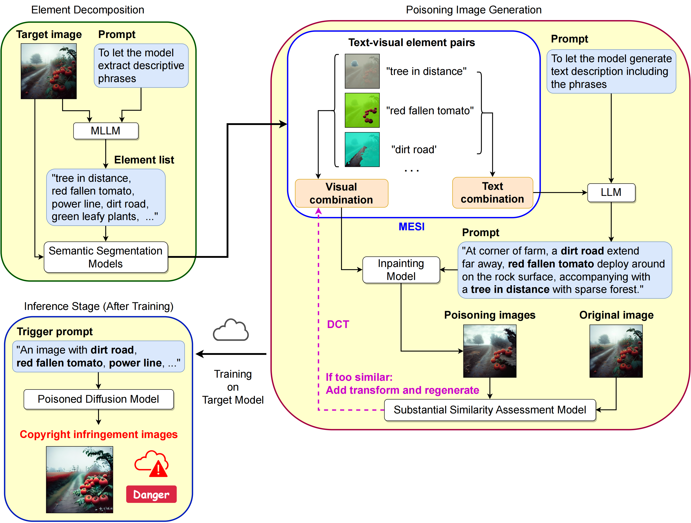

# ME: Trigger Element Combination Backdoor Attack on Copyright Infringement

Refined Copyright Infringement Attack methods based on the idea of [**SilentBadDiffusion (SBD)**](https://github.com/haonan3/ICML-2024-Oral-SilentBadDiffusion).

[**Paper**](https://arxiv.org/abs/2506.10776)

---



## 📖 Overview

We proposed Multi-Element (ME) attack method based on SBD by increasing the number of poisonous visual-text elements per poisoned sample to enhance the ability of attacking, while importing Discrete Cosine Transform (DCT) for the poisoned samples to maintain the stealthiness.

## 🔧 Installation

### Notice

- (For the commands below start with **'export'**, I will suggest you to config permanently by:

```bash
vim ~/.bashrc
# type in the commands, save, out
source ~/.bashrc   # apply them
```

so that you do need to set these next time.)

### Start

Install [**torch**](https://pytorch.org/?ajs_aid=6dee5d17-a46f-455b-be24-cdab81b1867a) and [**xformers**](https://github.com/facebookresearch/xformers) like the following commands. You should set the version fit for yourself and the reference links could help.

```bash
pip install torch==2.6.0 torchvision==0.21.0 torchaudio==2.6.0 --index-url https://download.pytorch.org/whl/cu124
pip3 install -U xformers --index-url https://download.pytorch.org/whl/cu124
```

Clone ME. (For all commands about installing **requirements.txt**, you could consider delete all version numbers in **requirements.txt** before execution.)

```bash
git clone https://github.com/Y-FY-Jr/ME.git
cd ME
pip install -r requirements.txt
```

Clone and configure the [**Grounded-Segment-Anything**](https://github.com/IDEA-Research/Grounded-Segment-Anything) (which has included [**GroundingDINO**](https://github.com/IDEA-Research/GroundingDINO) and [**SegmentAnything**](https://github.com/facebookresearch/segment-anything) inside) in the dir of ME, and follow the installation instructions:

```bash
git clone https://github.com/IDEA-Research/Grounded-Segment-Anything.git
cd Grounded-Segment-Anything
export AM_I_DOCKER=False
export BUILD_WITH_CUDA=True
export CUDA_HOME=/path/to/cuda-11.3/
python -m pip install -e segment_anything
```

Configure GroundingDINO.

```bash
cd GroundingDINO
python setup.py build
python setup.py install
cd ..
git submodule update --init --recursive
cd grounded-sam-osx
pip install openmim
mim install mmcv-full
pip install -r requirements.txt
cd transformer_utils && python setup.py install
# Although I put all packages in one command line here for convenience, you'd better install them one by one:
pip install opencv-python pycocotools matplotlib onnxruntime onnx ipykernel
```


## 🔧 Debug (If you really face problem)

1. If you fail to invoke GroundingDINO on GPU like this:

```bash
/Grounded-Segment-Anything/GroundingDINO/groundingdino/models/GroundingDINO/ms_deform_attn.py:31: UserWarning: Failed to load custom C++ ops. Running on CPU mode Only!
  warnings.warn("Failed to load custom C++ ops. Running on CPU mode Only!")
UserWarning: Failed to load custom C++ ops. Running on CPU mode Only!

...

Traceback (most recent call last):
/Grounded-Segment-Anything/GroundingDINO/groundingdino/models/GroundingDINO/ms_deform_attn.py", line 53, in forward
    output = _C.ms_deform_attn_forward(
NameError: name '_C' is not defined
```

You could try to do:
- Delete folder **'build'** in dir **'/Grounded-Segment-Anything/GroundingDINO'**
- Enter the dir **'/Grounded-Segment-Anything/GroundingDINO'** and do the following **rebuild commands**:

```bash
# re-build & re-intsall
pip uninstall groundingdino
python setup.py build
python setup.py install
```

If the error is still unchanged:


2. TypeError: BoxAnnotator.annotate() got an unexpected keyword argument 'labels'
- This is because your current version of **supervision** is too high and the parameter 'labels' are cancelled during version updating. Return it to version around 0.18 would fix this.

```bash
 pip install supervision==0.18.0
```


## 🔧 Running

Example for main pipeline of ME.

```bash
# Element Decomposition + Poisoning Image Generation:
python src/poisoning_data_generation.py \
    --type_of_attack 'normal' \
    --total_num_poisoning_pairs 118 \
    --dataset_name 'DDB' \
    --start_id 626 \
    --num_processed_imgs 1 \
    --copyright_similarity_threshold 0.5 \
    --high_freq_sample_rate 0.0 \
    --num_elements_per_sample 3 \

# Training
python src/target_model_training.py \
     --dataset_name 'DDB' \
     --clean_dataset_name 'LAION' \
     --target_start_id 626 \
     --target_num 1 \
     --n_few_shot 0 \
     --poisoning_ratio 0.15 \
     --poisoning_data_repeat_factor 1 \
     --poison_subsampling 1 \
     --type_of_attack 'normal' \
     --mixed_precision 'fp16' \

# Inference after training
python src/testing_many_times.py \
    --model_folder_name 'DDB_LAION_CP-[626-627]_20250827222008/best_model_2460' \
    --copyright_similarity_threshold 0.5 \
    --type_of_attack 'normal' \
    --test_mode 'poison' \
    --num_of_test_per_image 10 \
```
